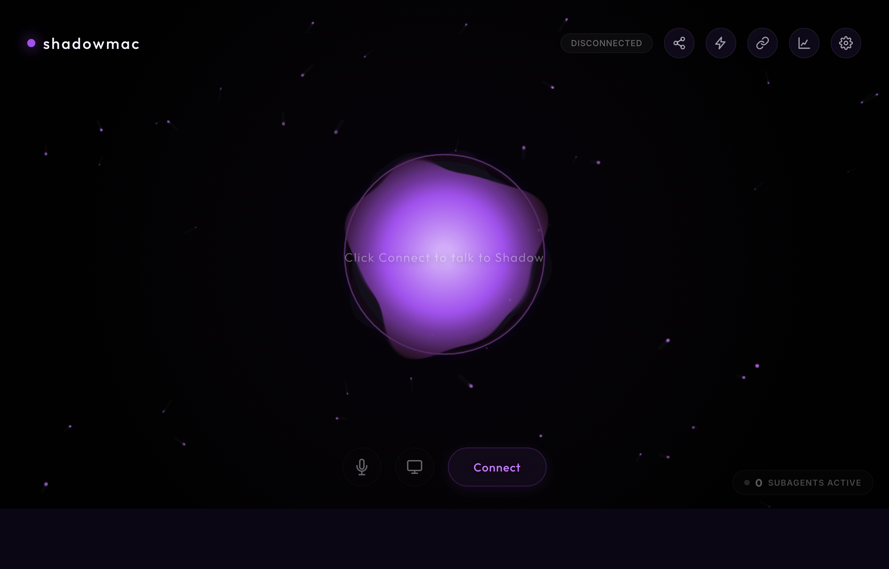

<div align="center">

# 🟣 ShadowMac

### A real-time, voice-first AI companion — running natively on macOS.

Hands-free real-time voice · long-term memory · web search · background subagents.

<br>



</div>

---

> ### Credit & license
> **ShadowMac is a macOS port of [Shadow AI](https://github.com/shadowdoggie/shadow-ai) by [shadowdoggie](https://github.com/shadowdoggie).**
> The original is a Windows-only project. This fork keeps the original web app and
> adds a macOS backend, launcher, and search setup so it runs on a Mac. All credit
> for the core application — the voice engine, memory graph, subagents, and UI —
> goes to the original author.
>
> Licensed under **AGPL-3.0** (same as the original). You are free to use, study,
> modify, and share this, but you must keep this attribution and the `LICENSE`
> file, and any distributed or network-hosted version must offer its source under
> AGPL-3.0. See [`LICENSE`](LICENSE).
>
> ShadowMac is an independent project and is **not affiliated with, endorsed by,
> or sponsored by** the original author. "Shadow AI" is referenced only to
> credit the original work.

---

## ✨ What it does

- 🎙️ **Real-time voice conversation** — natural, low-latency back-and-forth (not push-to-talk), powered by the Gemini Live API.
- 🌍 **Any language** — talk in any language, even switching mid-sentence.
- 🧠 **Long-term memory** — builds a personal memory graph and recalls it later.
- 🔎 **Live web search** — via a local SearXNG instance.
- 🤖 **Background subagents** — spins up agents for multi-step tasks while you keep talking.
- ⏰ **Reminders & scheduling** — hands-free.
- 📅 **Optional Google Workspace** — Gmail, Calendar, Drive, Contacts using *your own* Google credentials.

## 🖥️ What's different from the original (the macOS port)

| Piece | Original (Windows) | ShadowMac (macOS) |
|---|---|---|
| Backend / API server | `run.ps1` (PowerShell HTTP listener) | `server.js` (Node) |
| Launcher | `run.ps1` / `run.bat` | `run.sh` |
| Model command execution | `powershell.exe` | bundled PowerShell 7 (`runtime/pwsh`) |
| Search engine setup | `prepare-searxng.ps1` | `tools/prepare-searxng.sh` |
| Open-in-browser | `Start-Process` | `open` |

**Not ported:** the Windows desktop mouse/keyboard control (`desktop_controller.ps1`, uses Win32 APIs) and the global push-to-talk hotkey. Everything else works.

## 🚀 Getting started (macOS)

**Prerequisites:** [Node.js](https://nodejs.org) 18+, Python 3.11+, and Google Chrome.

```sh
# 1. one-time: set up the local search engine (a few minutes)
./tools/prepare-searxng.sh

# 2. run it
./run.sh
```

A ShadowMac window opens in Chrome. On first run, paste a free
[Gemini API key](https://aistudio.google.com/apikey) — it stays local on your machine.

## 🎨 Theme

ShadowMac ships with an electric-violet theme. The palette lives in the `:root`
block of `src/index.css` (`--accent` and friends) plus the voice-orb colors in
`src/scripts/07-visualizer.js` — change those to re-skin it.

## 📄 License

[AGPL-3.0-or-later](LICENSE) — inherited from the upstream project. Keep the credit above intact.
